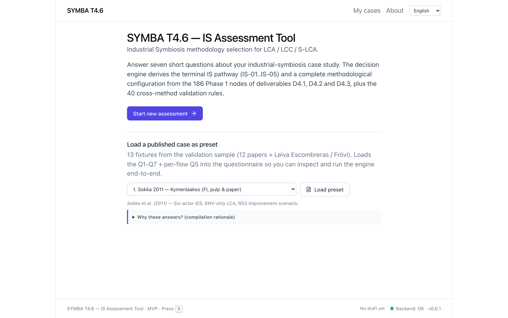
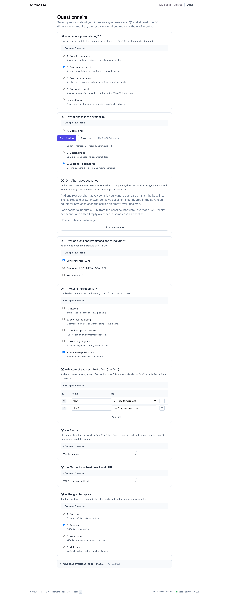
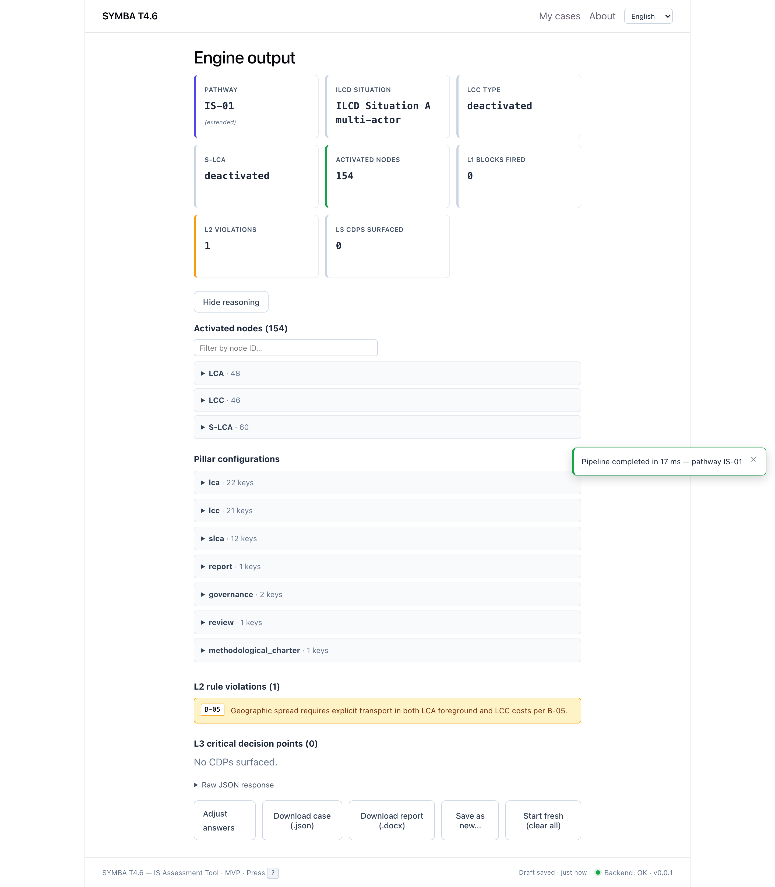
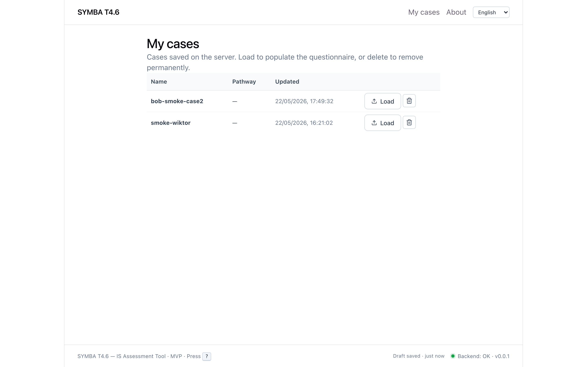
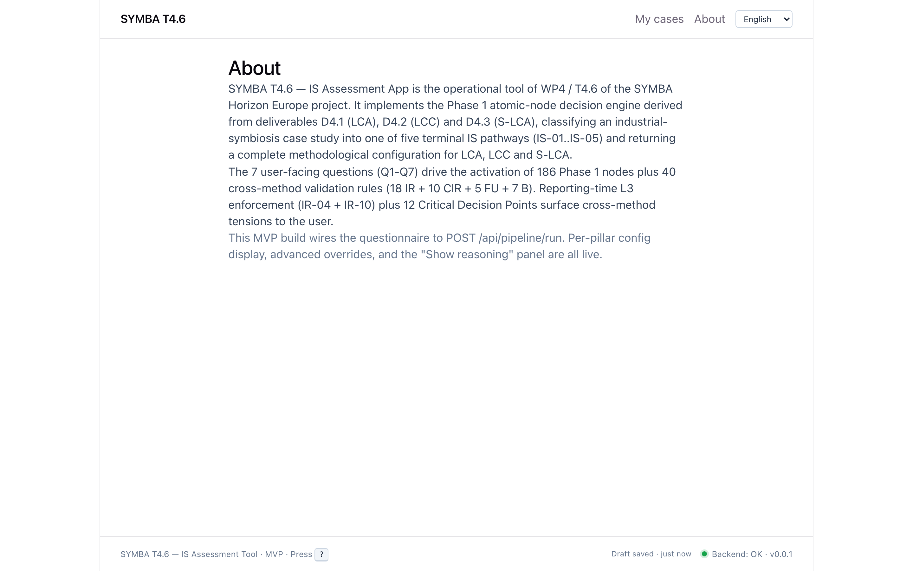

# SYMBA T4.6 — Il motore metodologico LCSA per la Simbiosi Industriale

> Documento teorico per presentazione (sorgente per slide / PPTX).
> Versione: 2026-06-11 · Stato progetto: MVP completo.
> Riferimenti autoritativi: `docs/implementation/SPRINT4_BOOTSTRAP_v2.md`,
> `docs/implementation/PHASE1_NODE_MAPPING_v2.md`, i 5 JSON schema in `backend/app/schemas/`.

---

## 1. Cos'è SYMBA T4.6 (una slide)

SYMBA T4.6 è un'app web che assiste l'analista di sostenibilità nel **definire la
metodologia LCSA** (Life Cycle Sustainability Assessment = LCA + LCC + S-LCA) per
un caso di **Simbiosi Industriale** (Industrial Symbiosis, IS).

L'idea centrale: l'analista **non** deve conoscere a memoria centinaia di scelte
metodologiche (situazione ILCD, tipo di LCC, allocazione, zero-burden, futurizzazione,
review panel, ecc.). Risponde a **7 domande** ("riduttori di complessità") e il motore
**deriva deterministicamente** l'intera configurazione metodologica del caso.

- **Input**: 7 domande (Q1–Q7) + lista dei flussi di scambio + override avanzati.
- **Output**: situazione ILCD, tipo LCC, stato S-LCA, pathway IS, set di nodi
  metodologici attivati per pilastro, violazioni di regole, punti di decisione critici.

> Da uno spazio combinatorio enorme a **una configurazione coerente e tracciabile**,
> ottenuta rispondendo a 7 domande.

---

## 2. I tre pilastri LCSA e i loro percorsi

LCSA = tre valutazioni parallele su uno stesso sistema-prodotto:

| Pilastro | Sigla | Cosa misura | Gating |
|---|---|---|---|
| **LCA** | Environmental | Impatti ambientali di ciclo di vita | Q3 = ENV |
| **LCC** | Economic | Costi di ciclo di vita | Q3 = ECO |
| **S-LCA** | Social | Impatti sociali di ciclo di vita | Q3 = SOC |

Ogni pilastro ha un proprio **percorso metodologico** derivato dalle domande. Non sono
percorsi indipendenti: il motore impone **regole cross-method** che garantiscono coerenza
tra i tre (stesso confine di sistema, stessa unità funzionale, divieto di aggregazione, ecc.).

---

## 3. Attenzione: "5 pathway" ≠ numero di configurazioni metodologiche

Prima di rispondere "quanti percorsi", va sciolta un'ambiguità che in una presentazione
è facile fraintendere. **Esistono due nozioni diverse di "percorso":**

1. **Pathway IS (routing)** — l'esito della matrice γ Q1×Q2. Sono **5** (`IS-01…IS-05`).
   È *solo il bivio più esterno*, non la metodologia completa.
2. **Configurazione metodologica del caso** — il vero output: un **vettore ad alta
   dimensionalità** (quali dei 186 nodi sono attivi + con quali valori di campo + quali
   regole scattano). **Non è una lista enumerabile**; è il motivo per cui il motore è
   schema-driven e non una lookup table.

### La stratificazione (dal grossolano al fine)

| Livello | Cosa fissa | Cardinalità |
|---|---|---|
| **L1 — routing IS** | pathway γ (Q1×Q2) | **5** |
| **L2 — stati derivati dei 3 pilastri** | situazione ILCD × tipo LCC × stato S-LCA × pathway | **~28 raggiungibili** ¹ |
| **L3 — attivazione 186 nodi** | quali nodi DERIVED accesi + valori dei fielded | non enumerabile |
| **L4 — scelte per-flusso (Q5)** | 5 tipi di valorizzazione per flusso → `5^F` | illimitato (dipende da F flussi) |

¹ *Derivazione dalle regole, non una costante nel codice (confidenza media): ILCD e LCC
dipendono entrambi da Q1, quindi le combinazioni `(ILCD,LCC,S-LCA,pathway)` sono correlate,
non 5×4×2×5.*

### Ordine di grandezza dello spazio di input ("tutte le scelte ottenibili")

Ignorando i per-flusso:

```
Q1 · Q2 · Q3 · Q4 · Q6a · Q6b · Q7
 5 ·  4 ·  7 · 31 ·  16 ·  4 ·  4   ≈  1,1 milioni di combinazioni di input
```

- Q3 = 7 sottoinsiemi non vuoti di {ENV, ECO, SOC}
- Q4 = 31 sottoinsiemi non vuoti di 5 opzioni
- aggiungendo **Q5 per-flusso** (× 5^F, con F = numero di flussi) → 10⁸ e oltre, **illimitato**

> **Il senso del tool**: collassa uno spazio decisionale dell'ordine di **10⁶ input**
> (illimitato coi flussi) in **una** configurazione metodologica coerente e tracciabile,
> tramite 7 domande + regole cross-method. I "5 pathway" sono il **primo bivio**, non il
> conteggio delle metodologie ottenibili.

---

## 4. Il primo riduttore: i 5 pathway IS (γ matrix)

Il primo e più importante riduttore di complessità è la **matrice γ**: la combinazione
di **Q1 (archetipo dello scenario IS)** e **Q2 (postura temporale)** determina
deterministicamente **uno fra 5 pathway** `IS-01 … IS-05`.

> **Risposta secca: i pathway IS totali sono 5** (`IS-01, IS-02, IS-03, IS-04, IS-05`).
> *File: `backend/app/engine/pathway.py`, enum in `backend/app/domain/enums.py:162`.*

### Matrice γ (Q1 × Q2 → IS-xx)

```
        Q2=A     Q2=B     Q2=C     Q2=D
Q1=A  | IS-01   IS-01   IS-04   IS-01
Q1=B  | IS-01   IS-01   IS-04   IS-01
Q1=C  | IS-02   IS-02   IS-02   IS-02
Q1=D  | IS-03   IS-03   IS-03   IS-03
Q1=E  | IS-05   IS-05   IS-05   IS-05
```

### Regola in chiaro
- **Q1 = C** → **IS-02** (sempre) — pre-feasibility sector-wide
- **Q1 = D** → **IS-03** (sempre) — corporate ESG
- **Q1 = E** → **IS-05** (sempre) — prospettiva pubblica / regolatore
- **Q1 ∈ {A,B} ∧ Q2 = C** → **IS-04** (override "design-only")
- **Q1 ∈ {A,B} ∧ Q2 ∈ {A,B,D}** → **IS-01** — scambio bilaterale / eco-park

**Flag laterale**: `is_01_extended = True` se pathway = IS-01 **e** Q2 = D
(baseline + N scenari alternativi → richiede supporto scenario-matrix a valle).
Non è un sesto pathway, è un'annotazione su IS-01.

> Nota di provenienza: la matrice γ è una **convenzione architetturale** del progetto
> ("opzione γ"); i deliverable sorgente D4.1/D4.2/D4.3 non enumerano questa matrice 5×4.
> *(`pathway.py:3-6`)*

---

## 5. Il percorso LCA → la Situazione ILCD

Il framework ILCD distingue il **contesto decisionale** dello studio LCA. In SYMBA è
derivato dal nodo trigger L0 `lca_t1` **a partire dalla sola Q1**.

> **5 situazioni ILCD** *(`enums.py:120`)*

| Q1 | Situazione ILCD | Significato metodologico |
|---|---|---|
| A | **Situation A** | Scambio bilaterale specifico tra due imprese |
| B | **Situation A multi-actor** | Eco-park / rete pre-formata |
| C | **Situation B** | Pre-feasibility sector-wide (rete ampia, nessuna operazione live) |
| D | **Situation C2** | Corporate ESG (singola impresa in contesto di rete, user-specific) |
| E | **Situation C1** | Prospettiva settore pubblico / regolatore (system-wide) |

La situazione ILCD è usata a valle dalle regole cross-method (es. IR-02, IR-04) per
imporre coerenza tra LCA, LCC e S-LCA.

---

## 6. Il percorso LCC → il tipo di Life Cycle Costing

Il tipo di LCC è derivato dal nodo trigger L0 `lcc_trig_01` a partire da **Q1** e dal
flag **Q3.ECO** (è stata richiesta la dimensione economica?).

> **4 tipi LCC** *(`enums.py:134`)*

| Tipo | Stringa | Condizione | Significato |
|---|---|---|---|
| **Deactivated** | `deactivated` | Q3.ECO = false | Pilastro LCC inattivo |
| **C-LCC + E-LCC** | `C+E` | Q1 ∈ {A,B,E} ∧ Q3.ECO | LCC convenzionale (entità) + LCC ambientale (network) |
| **E-LCC + S-LCC + NTF** | `C+E+S` | Q1 = C ∧ Q3.ECO | LCC ambientale + societal + Network Thermodynamic Flow (sector-wide) |
| **C-LCC only** | `C-LCC` | Q1 = D ∧ Q3.ECO | Solo LCC convenzionale (corporate ESG → allocation-based) |

**Vincolo chiave**: per Q1 = D (corporate ESG) l'E-LCC è **bloccato** per incompatibilità
con il framework ILCD — imposto dal BLOCK `block_C2_plus_E-LCC` a livello L1.

---

## 7. Il percorso S-LCA → stato di attivazione

Il più semplice: derivato dal nodo trigger L0 `slca_t_01` a partire dal solo flag **Q3.SOC**.

> **2 stati S-LCA** *(`enums.py:143`)*

| Stato | Condizione | Significato |
|---|---|---|
| **Active** | Q3.SOC = true | Tutti i nodi S-LCA attivi |
| **Deactivated** | Q3.SOC = false | Pilastro S-LCA scartato |

**Vincolo di design**: in contesto IS l'S-LCA è **sempre Comparative** (mai Absolute) —
imposto dal BLOCK `block_anyQ1_plus_AbsoluteSLCA`.

---

## 8. Le 7 domande riduttori di complessità (Q1–Q7)

Le 7 domande costituiscono lo **spazio di input** del caso. Ciascuna restringe lo spazio
metodologico: alcune pilotano i trigger L0 (derivazioni deterministiche), altre attivano
nodi condizionali e regole. *(`enums.py:20-112`)*

### Q1 — Archetipo dello scenario IS *(single select)*
Pilota: situazione ILCD, tipo LCC, pathway.
| | Significato |
|---|---|
| A | Scambio specifico tra due imprese |
| B | Eco-park / rete pre-formata |
| C | Pre-feasibility sector-wide |
| D | Corporate ESG (singola impresa in contesto di rete) |
| E | Prospettiva settore pubblico / regolatore |

### Q2 — Postura temporale *(single select)*
Pilota: ex-post / ex-ante / dinamico, futurizzazione, baseline.
| | Significato |
|---|---|
| A | Ex-post (IS operativa, retrospettiva) |
| B | Ex-ante, parametri statici |
| C | Ex-ante con scenari dinamici (no baseline) → IS-04 |
| D | Ex-ante baseline + N scenari alternativi → flag IS-01 extended |

### Q3 — Dimensioni di sostenibilità *(multi-checkbox)*
Gating binario dei tre pilastri. Modellato come 3 boolean: `env`, `eco`, `soc`.
| Checkbox | Pilastro attivato |
|---|---|
| ENV | LCA (59 nodi) |
| ECO | LCC (61 nodi) |
| SOC | S-LCA (66 nodi) |

**BLOCK**: `block_Q3_emptySelection` — nessun checkbox selezionato → STOP.

### Q4 — Uso dei risultati *(multi-select)*
Pilota: review policy, disclosure, pedigree matrix, restrizioni sul weighting.
| | Significato | Conseguenza |
|---|---|---|
| A | Solo interno (R&D / decision support) | Nessun panel, no disclosure pubblica |
| B | Business-to-business (no claim pubblico) | IR-10 anti-aggregazione; no single-score |
| C | Claim pubblico di superiorità | Panel review ≥3 esperti (ISO 14044), Monte Carlo obbligatorio, weighting vietato |
| D | Allineamento policy UE / PEF | Panel raccomandato, pedigree, Monte Carlo obbligatorio |
| E | Pubblicazione accademica (peer review) | Pedigree matrix, weighting scoraggiato |

### Q5 — Tipo di valorizzazione *per-flusso* *(una riga per flusso IS)*
Pilota: allocazione, modalità di sostituzione, test zero-burden.
| | Significato | Conseguenza |
|---|---|---|
| a | Scarto/sottoprodotto, zero burden | Test zero-burden standard |
| b | EVT contesa (economica vs tecnica) | Biforcazione economic/technical |
| c | Sostituzione / Q-correction | Tabella Q-correction, ISO 14049 |
| d | Produzione multifunzionale interdipendente | Zero-burden **vietato** (lca_hc_17) |
| e | Aggregato / black-box | Mandato black-box; **blocca** Q1=A (`block_Q1A_plus_Q5e`) |

### Q6a — Overlay settoriale *(single select)*
14 settori canonici + NONE + OTHER. Attiva attivazioni settore-specifiche
(es. `lca_mc_30` AWARE per wastewater). *(`enums.py:63`)*

### Q6b — Banda TRL *(single select)*
Pilota: framework di scale-up, soglia Monte Carlo, ammortamento capital goods.
`TRL9` · `TRL7-8` · `TRL5-6` · `TRL<5`. (TRL < 9 → orizzonte capital goods 15 anni + Monte Carlo obbligatorio.)

### Q7 — Estensione geografica *(single select)*
Pilota: assunzioni di trasporto, sensitività di accoppiamento spaziale.
| | Significato |
|---|---|
| A | Sito singolo / co-locato (trasporto trascurabile) |
| B | Area metropolitana (sensitività break-even distanza) |
| C | Regionale / nazionale (sensitività obbligatoria) |
| D | Cross-border / multi-paese (variabilità regolatoria + coupling LCA-LCC) |

---

## 9. Come si arriva dalla domanda alla metodologia: la pipeline

Il motore è **schema-driven**: la logica è nei 5 JSON, non hard-coded. Una run esegue
6 stadi *(`backend/app/engine/pipeline.py`)*:

```
        ┌─────────────────────────────────────────────┐
        │ INPUT: Case (Q1–Q7 + flussi + advanced)     │
        └───────────────────┬─────────────────────────┘
                            ▼
   L0  ── compute ───  3 nodi trigger deterministici
                       lca_t1 → ilcd_situation
                       lcc_trig_01 → lcc_type
                       slca_t_01 → slca_activation_state
                            ▼
   L1  ── blocks ───   4 celle BLOCK (veti)
                       se scatta un veto → SHORT-CIRCUIT (caso bloccato)
                            ▼
  PATHWAY ── derive ── Q1 × Q2 → IS-01..IS-05 (matrice γ)
                            ▼
  ACTIVATE ── run ───  186 nodi atomici → dict per pilastro
                       96 fielded (scrivono un campo) +
                       90 procedural_mandate (mandati di pratica)
                       11 nodi per-flow iterano sui flussi
                            ▼
   L2  ── validate ──  regole assertion + action
                       20 IR + 10 CIR + 5 FU + 7 B
                       violazioni → case.rule_violations
                            ▼
   L3  ── report ────  enforcement IR-04 + IR-10
                       surfacing 12 CDP (punti decisione critici)
                            ▼
        ┌─────────────────────────────────────────────┐
        │ OUTPUT: configurazione metodologica completa │
        │ + violazioni + CDP, tutto tracciabile        │
        └─────────────────────────────────────────────┘
```

**Logica di attivazione dei nodi**: ogni nodo è `DEFAULT` (sempre attivo per il suo
pilastro) oppure `DERIVED` (condizionale). I DERIVED si attivano via *discriminative
logic* (branching sulle risposte Q) o *predicate logic* (condizioni simple/conj/disj sullo
stato del caso). I `procedural_mandate` non hanno un campo da scrivere: sono mandati di
pratica metodologica.

---

## 10. I numeri chiave (slide riepilogo)

> Tutti verificati dal validation script — **0 critical / 0 warning / 0 UNKNOWN / PASS**.

| Artefatto | Valore |
|---|---|
| **Pathway IS totali** | **5** (IS-01…IS-05) |
| Situazioni ILCD (LCA) | 5 |
| Tipi LCC | 4 |
| Stati S-LCA | 2 |
| Domande input (riduttori) | 7 (Q1–Q7) |
| **Nodi atomici Phase 1** | **186** (LCA 59 · LCC 61 · S-LCA 66) |
| └ fielded / procedural_mandate | 96 / 90 |
| └ per-flow | 11 |
| **Regole cross-method** | **58** = 4 BLOCK + 20 IR + 10 CIR + 5 FU + 7 B + 12 CDP |
| Campi schema | 16 system + 12 computed + 20 cir_output |
| Settori overlay (Q6a) | 14 (+ NONE/OTHER) |

---

## 11. Il tool in azione (screenshot)

### Home — punto di ingresso + caricamento preset


### Questionario — le 7 domande Q1–Q7 + flussi


### Output del motore — configurazione metodologica derivata
La schermata mostra il caso `Sokka 2011` (eco-park, pulp & paper): pathway **IS-01**,
**ILCD Situation A multi-actor**, **154 nodi attivati** (LCA 48 · LCC 46 · S-LCA 60),
0 BLOCK, 1 violazione L2 (B-05: il geographic spread richiede trasporto esplicito),
configurazioni per pilastro espandibili e reasoning panel.


### Lista casi salvati


### About


> *Screenshot generati con Playwright/Chromium su build dev (frontend :5180 + backend :8088),
> dataset preset di validazione. UI in inglese (lingua di default del detector); il tool è
> localizzato in 5 lingue (en/it/fr/de/es).*

---

## 12. Stato del progetto (slide di chiusura)

- **MVP completo**, in attesa di prossima direzione.
- Schema engineering **CLOSED** (closure post-round-2): i 5 JSON sono la fonte di verità.
- Baseline test: **190 backend (pytest) + 14 frontend (vitest)**.
- Frontend React 19 + i18n in **5 lingue** (en/it/fr/de/es).
- Stack: FastAPI (Python 3.12) + SQLAlchemy 2.0 + Pydantic v2 · React 19 + Vite + Zustand.
- Parte del progetto **SYMBA** (GA 101135562, WP4 — Task 4.6), consorzio a 9 partner.

---

### Appendice — glossario rapido
- **IS** = Industrial Symbiosis · **LCSA** = Life Cycle Sustainability Assessment
- **ILCD** = International Reference Life Cycle Data System (framework di contesto LCA)
- **C-LCC / E-LCC / S-LCC** = Conventional / Environmental / Societal Life Cycle Costing
- **NTF** = Network Thermodynamic Flow · **EVT** = Economic vs Technical valuation
- **IR / CIR / FU / B / CDP** = famiglie di regole cross-method (Integration / Conditional
  Integration / Functional Unit / Boundary / Critical Decision Point)
- **TRL** = Technology Readiness Level
</content>
</invoke>
